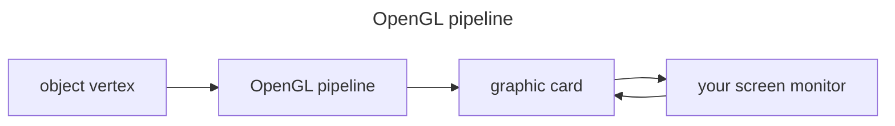
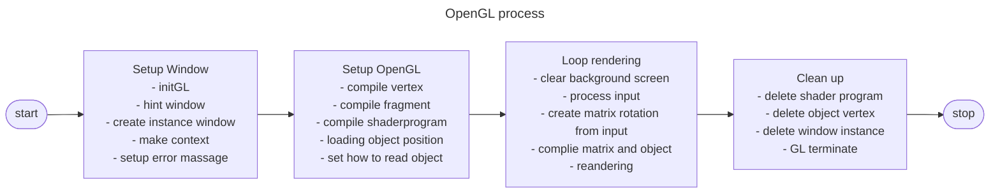
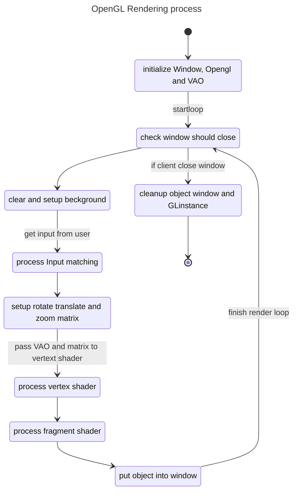

# OpenGL

## What is OpenGL

**OpenGL**(Open Graphic Library) is an API for send your object to
Graphic card for rendering.

In a graphic programming we using OpenGL like a **pipeline**
that we just send **object vertex** in to a pipeline and let GPU render it self.



## How to setup OpenGL pipeline

first you have to know these concepts.

- [What is object file](#object-file)
- [what is GLEW](#glew)
- [What is VBO VAO and EBO](#vbo-vao-and-ebo)
- [What is shader](#shader)

resource

- [vao, vbo](https://youtu.be/hG5p7OSP3Wk?si=vPqpjoNxMZy3iShq)
- [vertex and fragment shader](https://youtu.be/KqwvGAkKTtU?si=cCW4Sbo8YWR6guLo)

**Pipeline process**



## Concepts of OpenGL

### Object File

Object file is a file that store all information from object like name vertex vertexNormal vertexTexture face and etc.

Important information in object file:

- `o` - **Object name.**
- `v` - **Vertex**: cordinate of x, y, z position for vertex.
- `f` - **Facelink**: linker to link many vertex in to one page.

and other information should know:

- `vn` - **Vertex Normal**: cordinate that vertical from face to make light rendering correctly.
- `vt` - **Vertex Texture**: cordinate of x and y axis from texture to press in to face when rendering.
- `mtllib` - **Matetial Library**: import file mtl and parse to use in object.
- `usemtl` - **Use Matetial**: after this line all face will use this matetial.

---

### VBO VAO and EBO

**VBO**(Vertex Buffer Object) is a buffer in GPU that stored vertex information viz v, vn, vt,
and VBO can also dupplicate for store each information.

**VAO**(Vertex Array Object) is a one array buffer for stored pointers of buffer object.

**EBO**(Element Buffer Object) is a buffer of array that stored index of vertex to draw.

#### Q&A

**Question**: if we have only one VBO, but we have many information like v, vn, vt in VBO
how GPU know what is type of information.  
**Answer**: you should use `glVertexArrayAttribFormat` for split information when GPU read one line
like `[vx, vy, vz, vtx, vty, vnx, vny, vnz]` to `[v * 3], [vt * 2], [vn * 3]` and GPU can read it correctly.

---

### Shader

**Shader** is a main program for GPU to used it for rendering, you can customize anything in shader source,
GPU will read it and follow the process.

you have to send 2 shader source:

- **vertex shader source**: shader for write vertex, you have to fill veriable `gl_Position` for make it work
- **fragment shader source**: shader for rendering page color and light, pass paramiter from vertex shader source,
and you have to fill variable name `FragColor` to paint color on it.

---

### Context window

Basically gpu will use thread for rendering, function `glfwMakeContextCurrent(_window);`
just send to openGL to lock flags, that use thread for create image to this window only.

---

### Library glew

When you want to use modern feature such as shader, texture, vertex buffer you have to query OS and GPU driver
to manually load pointer to these function in memory, GLEW will load and handle that automatically.


---

## Dependencies package

- nixos

```nix
buildInputs = with pkgs; [
    glew
    libGL
    glfw
];
shellHook = ''
    export LD_LIBRARY_PATH="${pkgs.libGL}/lib:${pkgs.glew}/lib:$LD_LIBRARY_PATH"
'';
```

## Header

opengl have to import this header

```c++
#include <GL/glew.h>
#include <GLFW/glfw3.h>
```

- `glew.h` library for set API from any thardware to standart software API, for make glfw3 library can communicate with GPU.
- `glfw3.h` library is a standart library for opengl rendering and screen window creating.

---

### Runtime rendering


