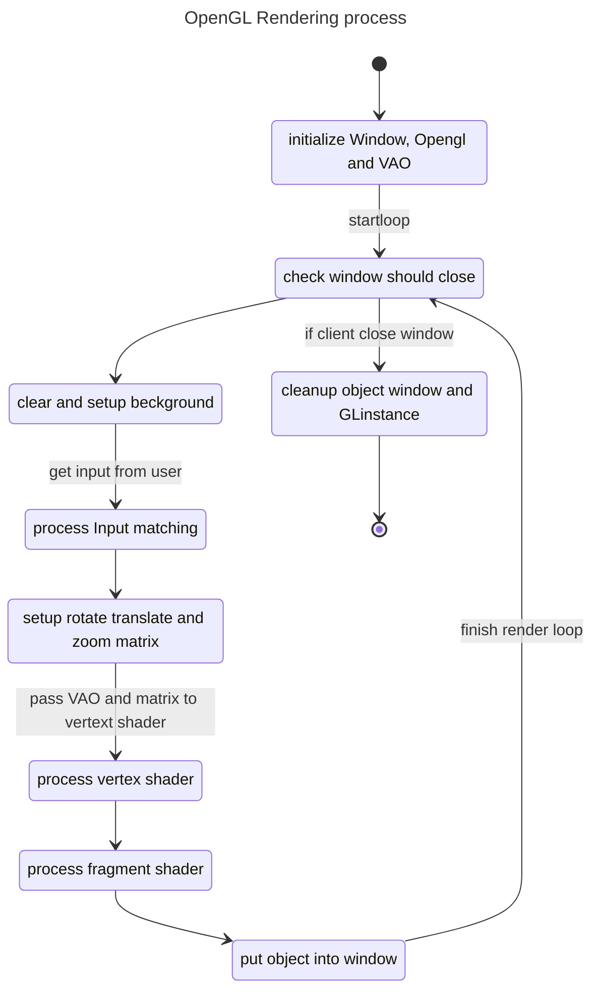

# OpenGL

## dependencies package

- nixos

```nix
buildInputs = with pkgs; [
    glew
    libGL
    glfw
];
shellHook = ''
    export LD_LIBRARY_PATH="${pkgs.libGL}/lib:${pkgs.glew}/lib:$LD_LIBRARY_PATH"
'';
```

## header

opengl have to import this header

```c++
#include <GL/glew.h>
#include <GLFW/glfw3.h>
```

- `glew.h` library for set API from any thardware to standart software API, for make glfw3 library can communicate with GPU.
- `glfw3.h` library is a standart library for opengl rendering and screen window creating.

## how OpenGL work


### learning resource

- [VAO](https://youtu.be/hG5p7OSP3Wk?si=vPqpjoNxMZy3iShq)
- [vertex and fragment shader](https://youtu.be/KqwvGAkKTtU?si=cCW4Sbo8YWR6guLo)

#### context window

Basically gpu will use thread for rendering, function `glfwMakeContextCurrent(_window);`
just send to openGL to lock flags, that use thread for create image to this window only.

#### glew

When you want to use modern feature such as shader, texture, vertex buffer you have to query OS and GPU driver
to manually load pointer to these function in memory, GLEW will load and handle that automatically.

---

### Runtime rendering


